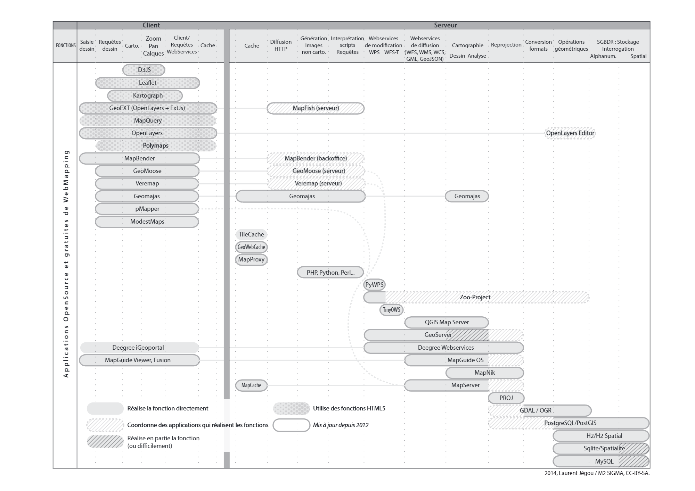
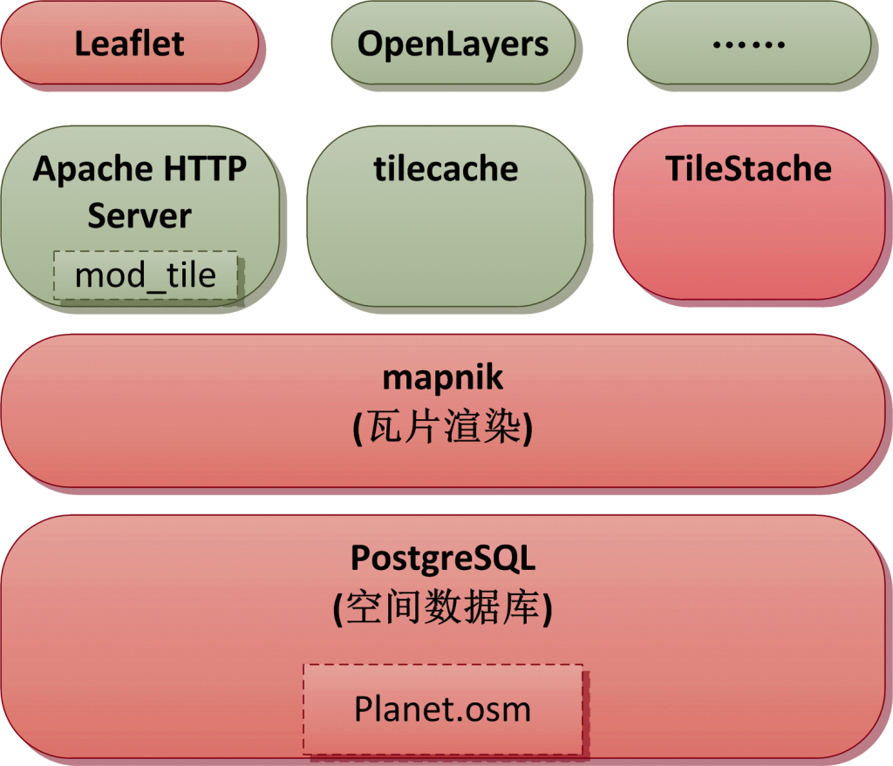
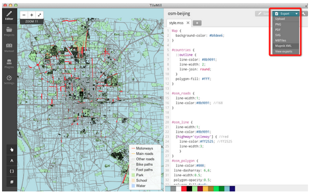
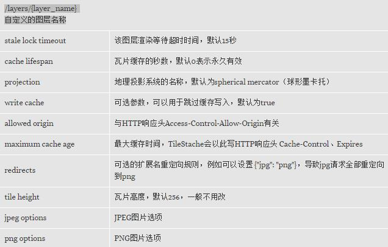

## GIS基础知识

### GIS基本组件

* **地图数据库**：提供地图数据，例如OSM的planet.osm可以导入PostgreSQL作为地图数据库

* **瓦片服务器**：负责生成一系列的瓦片（tiles），这些瓦片通常为256像素的方块，瓦片组在一起形成地图。对于Google Map，瓦片服务器是Google提供的，用户不能接触其地图数据库；对于OSM，地图数据库是开放的，可以随意下载，需要自己搭建瓦片服务器

* **前端API**：用于浏览器的JavaScript API，或者用于移动客户端的同功API。例如OpenLayers、Leaflet。



### 坐标参考系统（Coordinate Reference Systems）

又称空间参考系统（spatial reference system，SRS），是基于二维坐标的，用于定位局部、区域或者全球地理信息资源的体系。CRS定义了一种地图映射规则、与其它CRS之间进行转化的算法。CRS是GIS系统的基础。

最常用的两种CRS为：

<table>
<thead>
<th>CRS</th>
<th>说明</th>
</thead>
<tbody>
<tr>
<td>EPSG:4326</td>
<td>
以经纬度直接作为X（经度）、Y（维度）坐标，南纬、西经采用负数表示<br/>
投影范围: -180.0000, -85.0600, 180.0000, 85.0600
</td>
</tr>
<tr>
<td>EPSG:3857</td>
<td>
主要用于Web地图等应用程序，最初由Google地图提出，故经常称为900913，基于椭圆形墨卡托（ellipsoidal Mercator ）投影<br/>
投影范围： -180.0000, -90.0000, 180.0000, 90.0000
</td>
</tr>
</tbody>
</table>


## OpenStreetMap基础知识

### OpenStreetMap的优势

* 地图数据开源，人人可以编辑，并且可以完整的下载，部署私有的地图服务器
* 内容丰富，比起ESRI Shapefiles的点、面、线，支持更多复杂的元素
* 生态圈活跃，从地图数据、数据库、地图渲染、瓦片服务器、前端API，到桌面、Web地图设计工具，具有大量优秀的开源组件

### OpenStreetMap生态圈


## 搭建地图服务器

### Windows下搭建OSM服务器的详细步骤

目前网络上的例子，大多是在Linux下搭建OSM服务器。实际项目中由于客户现场环境的限制，可能必须使用Windows Server，故本文详细记录Windows下的搭建步骤，供各位参考。

* **系统架构**


上图中红色部分为本文主要使用的组件，我们把这些组件全部安装到一个目录%OSM_STACK%下

* **下载地图**

区域地图，可从这里下载：[http://download.geofabrik.de/](http://download.geofabrik.de/)<br/>
全球地图，可从这里下载：[http://ftp.heanet.ie/mirrors/openstreetmap.org/planet/2015/planet-150105.osm.bz2](http://ftp.heanet.ie/mirrors/openstreetmap.org/planet/2015/planet-150105.osm.bz2)

* **安装Python**

安装Python 2.7.x到%OSM_STACK%\python，并加入PATH环境变量，下载地址：[https://www.python.org/ftp/python/2.7.9/python-2.7.9.msi](https://www.python.org/ftp/python/2.7.9/python-2.7.9.msi)<br/>
为避免后续需要下载依赖的模块，可以安装便携版的Python，集成了很多常用模块，安装后把App目录里面的所有文件拷贝到%OSM_STACK%\python即可，下载地址：[http://ftp.osuosl.org/pub/portablepython/v2.7/PortablePython_2.7.6.1.exe](http://ftp.osuosl.org/pub/portablepython/v2.7/PortablePython_2.7.6.1.exe)

* **安装PostgreSQL和PostGIS**

最好下载PostgreSQL 9.0以上或者 8.3版，8.4存在性能问题。<br/>
9.4的下载地址：[http://get.enterprisedb.com/postgresql/postgresql-9.4.0-1-windows-binaries.zip](http://get.enterprisedb.com/postgresql/postgresql-9.4.0-1-windows-binaries.zip)<br/>
解压到%OSM_STACK%\psql<br/>
下载PostGIS：[http://download.osgeo.org/postgis/windows/pg94/](http://download.osgeo.org/postgis/windows/pg94/)<br/>
解压覆盖到%OSM_STACK%\psql<br/>
注意：上述的PostgreSQL是绿色版的，对MSVC12有C运行时库、C++标准库有依赖，如果你的机器缺少msvcp120.dll、msvcr120.dll这两个DLL，可以下载：Visual C++ Redistributable Packages for Visual Studio 2013并安装，亦可直接拷贝这两个文件到%OSM_STACK%\psql\bin下<br/>

下面的脚本说明如何初始化PostgreSQL、创建用户gisuser、数据库gis、激活PostGIS：
```
@echo off
 
pushd "%~dp0"
 
SET "PGDATA=%PSQL_HOME%\data"
SET "PGDATABASE=postgres"
SET "PGUSER=postgres"
SET "PGPORT=5439"
SET "PGLOCALEDIR=%PSQL_HOME%\share\locale"
rem GIS databse name and owner
SET "GISDATABASE=gis"
SET "GISUSER=gisuser"
 
echo ****** Prepare to initializing PostgreSQL  ****** 
rem 初始化数据库，这将生成data目录，并且根据机器硬件环境生成配置文件
initdb -U %PGUSER% -A trust
 
echo ****** Prepare to start PostgreSQL  ****** 
rem 启动数据库，日志记录到pgsql.log，等待启动完成
pg_ctl -w -l %PSQL_HOME%\pgsql.log start
 
echo ****** Creating user %GISUSER%  ****** 
rem 创建GIS专门用户
createuser -U %PGUSER% %GISUSER%
echo ****** Creating database %GISDATABASE%  ****** 
rem 创建GIS专用数据库
createdb -U %PGUSER% -E UTF8 -O %GISUSER% %GISDATABASE%
echo ****** Installing procedural language into %GISDATABASE%  ****** 
rem 添加扩展
createlang -U %PGUSER% plpgsql %GISDATABASE%
echo ****** Activating PostGIS for %GISDATABASE%  ****** 
rem 为GIS数据库激活PostGIS支持
psql -U %PGUSER% -d %GISDATABASE% -f "%PSQL_HOME%\share\contrib\postgis-2.1\postgis.sql"
psql -U %PGUSER% -d %GISDATABASE% -f "%PSQL_HOME%\share\contrib\postgis-2.1\spatial_ref_sys.sql"
rem After the activation, the following command should list the tables geometry_columns and spatial_ref_sys:
rem 下面这一句不能在UTF-8代码页下运行，会报内存不足的错误
psql --username=%GISUSER% --dbname=%GISDATABASE% --command="\d"
rem 停止数据库
pg_ctl -w stop
```

打开%OSM_STACK%\psql\data\postgresql.conf，修改以下参数，以提高性能（根据硬件配置调整）：

```
shared_buffers = 512MB  
checkpoint_segments = 20  
maintenance_work_mem = 256MB  
autovacuum = off  
 
kernel.shmmax=536870912
```

* **导入地图到数据库**

 使用命令行工具osm2pgsql 可以把OpenStreetMap地图数据导入到启用了postGIS的PostgreSQL数据库中。尽管mapnik可以直接渲染OSM XML原始数据，但是导入PostGIS可以使用更多的高级特性。
从这里下载此工具：[http://customdebug.com/osm/osm2pgsql.zip](http://customdebug.com/osm/osm2pgsql.zip)
使用示例：
```
osm2pgsql -c -d gis -U postgres -H localhost -P 5439 -S default.style  -C 600 beijing.osm.bz2
```
default.style是 导入时需要的样式定义文件，内容如下：
```
# OsmType  Tag          DataType     Flags
node,way   access       text         linear
node,way   addr:housename      text  linear
node,way   addr:housenumber    text  linear
node,way   addr:interpolation  text  linear
node,way   admin_level  text         linear
node,way   aerialway    text         linear
node,way   aeroway      text         polygon
node,way   amenity      text         polygon
node,way   area         text         
node,way   barrier      text         linear
node,way   bicycle      text
node,way   brand        text         linear
node,way   bridge       text         linear
node,way   boundary     text         linear
node,way   building     text         polygon
node       capital      text         linear
node,way   construction text         linear
node,way   covered      text         linear
node,way   culvert      text         linear
node,way   cutting      text         linear
node,way   denomination text         linear
node,way   disused      text         linear
node       ele          text         linear
node,way   embankment   text         linear
node,way   foot         text         linear
node,way   generator:source    text  linear
node,way   harbour      text         polygon
node,way   highway      text         linear
node,way   historic     text         polygon
node,way   horse        text         linear
node,way   intermittent text         linear
node,way   junction     text         linear
node,way   landuse      text         polygon
node,way   layer        text         linear
node,way   leisure      text         polygon
node,way   lock         text         linear
node,way   man_made     text         polygon
node,way   military     text         polygon
node,way   motorcar     text         linear
node,way   name         text         linear
node,way   natural      text         polygon
node,way   office       text         polygon
node,way   oneway       text         linear
node,way   operator     text         linear
node,way   place        text         polygon
node       poi          text
node,way   population   text         linear
node,way   power        text         polygon
node,way   power_source text         linear
node,way   public_transport text     polygon
node,way   railway      text         linear
node,way   ref          text         linear
node,way   religion     text         nocache
node,way   route        text         linear
node,way   service      text         linear
node,way   shop         text         polygon
node,way   sport        text         polygon
node,way   surface      text         linear
node,way   toll         text         linear
node,way   tourism      text         polygon
node,way   tower:type   text         linear
way        tracktype    text         linear
node,way   tunnel       text         linear
node,way   water        text         polygon
node,way   waterway     text         polygon
node,way   wetland      text         polygon
node,way   width        text         linear
node,way   wood         text         linear
node,way   z_order      int4         linear
way        way_area     real
```

* **安装mapnik**

从[http://mapnik.org/download/](http://mapnik.org/download/)下载mapnik，解压到%OSM_STACK%\mapnik，将其bin、lib目录加入PATH环境变量，python\2.7\site-packages加入PYTHONPATH环境变量。<br/>
在mapnik中，一个Map可以包含若干个图层（Layer），每个层可以独立着色，即可为每个层定制样式（Style），每个样式由若干个规则组成（Rule），每个规则由是由若干个符号定制。

* **生成mapnik的样式文件**

从[https://www.mapbox.com/tilemill/](https://www.mapbox.com/tilemill/)下载并安装TileMill，该工具用于编辑地图元素的样式，我们主要用它导出mapnik的样式文件。
OpenStreetMap官方使用的样式托管在GitHub上：[https://github.com/gravitystorm/openstreetmap-carto](https://github.com/gravitystorm/openstreetmap-carto)。下载后解压到C:\Users\用户名\Documents\MapBox\project
打开Cygwin，或者在Linux下执行get-shapefiles.sh，下载并处理openstreetmap-cart中缺少的data目录：
```
#以Cygwin为例
 
apt-cyg install curl
apt-cyg install unzip
 
#编译gdal，在Ubuntu下只需要sudo apt-get install gdal-bin即可
#你也可以到http://download.gisinternals.com/下载编译好的二进制文件供Cygwin使用
wget http://download.osgeo.org/gdal/1.11.1/gdal-1.11.1.tar.gz
tar vzxf gdal-1.11.1.tar.gz
rm gdal-1.11.1.tar.gz
cd gdal-1.11.1/
./autogen.sh
./configure --host=mingw32 --without-libtool --without-python
make
make install
 
cd /cygdrive/c/Users/Suigintou/Documents/MapBox/project/openstreetmap-carto-master
./get-shapefiles.sh
#需要下载的数据较多，耐心等待
#如果出现Failed to connect to planet.openstreetmap.org port 80: Network is unreachable，则添加下一行到host文件
#193.63.75.107 planet.openstreetmap.org
```
下载、处理完成后，打开TileMill，可以看到OpenStreetMap Carto这个项目，点击打开，然后点击右上角按钮，导出mapnik样式文件，如下图：



导出成功后，打开XML文件，搜寻里面的类似：“C:\Users\用户名\Documents\MapBox\project\osm-carto\……”绝对路径，将其删除，并把路径中剩余部分的反斜杠改为正斜杠，修改完毕后，路径类似：“data/simplified-land-polygons-complete-3857/simplified_land_polygons.shp”，把文件移动到%OSM_STACK%\osm-carto目录下。
把整个openstreetmap-carto-master目录（就是TileMill编辑的工程）覆盖到%OSM_STACK%\osm-carto。

* **安装和配置TileStache**

安装便携版Python后，只需要执行下面的脚本：
```
easy_install tilestache
 
rem 可能需要检查以下依赖模块是否安装
easy_install PIL
easy_install ModestMaps
easy_install SimpleJSON
```
在Windows上，如果使用的是Python 2.7.6，需要修改一下__init__.py的源码，否则运行时会报错：<br/>
UnicodeDecodeError: utf8 codec can't decode byte 0xb0 in position 1: invalid start byte，这是Python的一个BUG。
```
import sys
reload(sys) 
sys.setdefaultencoding('gb18030') #添加上面三行即可
config_dict = json_load(urlopen(configpath))
```
安装完毕后，通过下面的脚本即可启动TileStache的Web服务（基于 Werkzeug，一个WSGI工具库）：
```
echo ****** Prepare to start TileStache  ****** 
SET "TILE_STACHE_SCR=%PYTHON_HOME%\Scripts\tilestache-server.py"
 
python "%TILE_STACHE_SCR:\=/%"   -p 5539 -c tilestache.cfg
```
其中tilestache.cfg是TileStache使用的配置文件，我们先使用下面这个做测试：
```
{
  "_comment": "tilestache.cfg包含两个顶级元素，分别实现缓存、图层的配置"
  "cache":
  {
    "name": "Disk",
    "path": "F:/Temp/tiles-cache"
  },
  "layers": 
  {
    "osm":
    {
        "provider": {"name": "proxy", "provider": "OPENSTREETMAP"}
    }
  }
}
```
启动TileStache后，可以通过以下几个URL来测试：
<table>
<thead>
<th>URL</th>
<th>说明</th>
</thead>
<tbody>
<tr>
<td>http://127.0.0.1:5539/osm/preview.html</td>
<td>交互式的地图预览</td>
</tr>
<tr>
<td>http://127.0.0.1:5539/osm/0/0/0.png</td>
<td>
显示一个静态瓦片，TileStache的URL风格类似于Google地图：
http://host:port/{layer name}/{zoom}/{column}/{row}.{extension} 
</td>
</tr>
</tbody>
</table>

* **集成TileStache与mapnik**



tilestache.cfg可以配置为这样：
```
{
  "cache":
  {
    "name": "Disk",
    "path": "D:/Programs/OsmStack/tilestache/cache"
  },
  "layers": 
  {
    "osm":
    {
        "provider": {
            "name": "mapnik", 
            "mapfile": "file://D:/Programs/OsmStack/osm-carto/mapnik-style.xml",
            "fonts" : "D:/Programs/OsmStack/mapnik/fonts"
        },
        "metatile" : {
            "rows" : "4",
            "columns" : "4",
            "buffer" : "64"
        },
        "preview" : {
            "lat" : "39.9396",
            "lon" : "116.3488",
            "zoom" : "12",
            "ext" : "png"
        }
    }
  }
}
```
注意其中的mapfile对应的路径，必须从Windows路径格式改为URI形式，例如：D:\Programs\Osmstack 改为 file://D:/Programs/Osmstack<br/>
tilestache.cfg改好后，启动TileStache Web服务，浏览器打开http://127.0.0.1:5539/osm/preview.html进行测试。

* **绿化批处理脚本示意**

在Windows下，可以参考下面三个脚本，分别完成地图服务器的初始化、启动、停止：

init.bat
```
@echo off
chcp 437
pushd "%~dp0"
 
set "OSMSTACK_HOME=%CD%"
set "OSM_DIR=%OSMSTACK_HOME%\osm"
set "MAPNIK_HOME=%OSMSTACK_HOME%\mapnik"
set "PYTHON_HOME=%OSMSTACK_HOME%\python"
set "PSQL_HOME=%OSMSTACK_HOME%\psql"
set "OSM2PQSQL_HOME=%OSMSTACK_HOME%\osm2pgsql"
set "PATH=%OSM2PQSQL_HOME%;%MAPNIK_HOME%\lib;%MAPNIK_HOME%\bin;%PSQL_HOME%\bin;%PYTHON_HOME%;%PYTHON_HOME%\Scripts;%PATH%"
set "PYTHONPATH=%MAPNIK_HOME%\python\2.7\site-packages;%PYTHONPATH%"
 
SET "PGDATA=%PSQL_HOME%\data"
SET "PGDATABASE=postgres"
SET "PGUSER=postgres"
SET "PGPORT=5432"
SET "PGLOCALEDIR=%PSQL_HOME%\share\locale"
rem GIS databse name and owner
SET "GISDATABASE=gis"
SET "GISUSER=gisuser"
 
echo ****** Prepare to initializing PostgreSQL  ****** 
initdb -U %PGUSER% --auth=trust --auth-host=trust --auth-local=trust --pwprompt -E UTF8
copy %PSQL_HOME%\postgresql.conf %PSQL_HOME%\data\postgresql.conf /y
 
echo ****** Prepare to start PostgreSQL  ****** 
pg_ctl -w -l %PSQL_HOME%\pgsql.log start
 
echo ****** Creating user %GISUSER%  ****** 
createuser -U %PGUSER% -P %GISUSER%
echo ****** Creating database %GISDATABASE%  ****** 
createdb -U %PGUSER% -E UTF8 -O %GISUSER% %GISDATABASE%
echo ****** Installing procedural language into %GISDATABASE%  ****** 
createlang -U %PGUSER% plpgsql %GISDATABASE%
echo ****** Activating PostGIS for %GISDATABASE%  ****** 
 
psql -U %PGUSER% -d %GISDATABASE% -f "%PSQL_HOME%\share\contrib\postgis-2.1\postgis.sql"
psql -U %PGUSER% -d %GISDATABASE% -f "%PSQL_HOME%\share\contrib\postgis-2.1\spatial_ref_sys.sql"
rem After the activation, the following command should list the tables geometry_columns and spatial_ref_sys:
psql --username=%GISUSER% --dbname=%GISDATABASE% --command="\d"
 
echo ****** Installing extension hstore for %GISDATABASE%  ****** 
echo create extension hstore; | psql -U %PGUSER% -d %GISDATABASE%
 
 
echo ****** Import OSM data into %GISDATABASE%  ****** 
echo Please input osm package name ( without suffix '.osm.bz2' ), Press Enter to skip : 
set /p OSM_NAME=
if defined OSM_NAME (
    osm2pgsql -c -d gis -U %PGUSER% -H localhost -P %PGPORT%  --hstore -S %OSM2PQSQL_HOME%\openstreetmap-carto.style  -C 600 %OSM_DIR%\%OSM_NAME%.osm.bz2
)
 
echo ****** Processing TilesTache config file ****** 
set __OSM_PATH=%~p0
set __OSM_PATH=%__OSM_PATH:\=/%
python "tilestache/generate-cfg.py" %__OSM_PATH%
 
echo ****** Prepare to stop PostgreSQL  ****** 
pg_ctl -w stop
 
:end
```

startup.bat
```
@echo off
chcp 437
pushd "%~dp0"
 
set "OSMSTACK_HOME=%CD%"
set "OSM_DIR=%OSMSTACK_HOME%\osm"
set "MAPNIK_HOME=%OSMSTACK_HOME%\mapnik"
set "PYTHON_HOME=%OSMSTACK_HOME%\python"
set "PSQL_HOME=%OSMSTACK_HOME%\psql"
set "OSM2PQSQL_HOME=%OSMSTACK_HOME%\osm2pgsql"
set "PATH=%OSM2PQSQL_HOME%;%MAPNIK_HOME%\lib;%MAPNIK_HOME%\bin;%PSQL_HOME%\bin;%PYTHON_HOME%;%PYTHON_HOME%\Scripts;%PATH%"
set "PYTHONPATH=%MAPNIK_HOME%\python\2.7\site-packages;%PYTHONPATH%"
 
 
SET "PGDATA=%PSQL_HOME%\data"
SET "PGDATABASE=postgres"
SET "PGUSER=postgres"
SET "PGPORT=5432"
SET "PGLOCALEDIR=%PSQL_HOME%\share\locale"
 
echo ****** Prepare to start PostgreSQL  ****** 
pg_ctl  -w  -l%PSQL_HOME%\pgsql.log start
 
echo ****** Prepare to start TileStache  ****** 
SET "TILE_STACHE_SCR=%PYTHON_HOME%\Scripts\tilestache-server.py"
 
python "%TILE_STACHE_SCR:\=/%"  -i 0.0.0.0 -p 5539 -c tilestache/osm.cfg
```

shutdown.bat
```
@echo off
chcp 437
pushd "%~dp0"
 
set "OSMSTACK_HOME=%CD%"
set "MAPNIK_HOME=%OSMSTACK_HOME%\mapnik"
set "PYTHON_HOME=%OSMSTACK_HOME%\python"
set "PSQL_HOME=%OSMSTACK_HOME%\psql"
set "PATH=%MAPNIK_HOME%\lib;%MAPNIK_HOME%\bin;%PSQL_HOME%\bin;%PYTHON_HOME%;%PATH%"
 
SET "PGDATA=%PSQL_HOME%\data"
SET "PGDATABASE=postgres"
SET "PGUSER=postgres"
SET "PGPORT=5432"
SET "PGLOCALEDIR=%PSQL_HOME%\share\locale"
 
echo ****** Prepare to stop PostgreSQL  ****** 
pg_ctl -w stop
```


> 以下是着重要学习的！！！

## 通过前端API使用OSM瓦片

### 使用OpenLayers

OpenLayers很久以来一直是在网页中嵌入OSM地图的标准选择，它是一个成熟、综合的JS库，学习曲线较为平缓，提供大量的特性，包括完整的投影支持（full projection support）、矢量绘图、预览地图（overview maps）等等。

下面是一个简单的例子：
```
<%@ page language="java" contentType="text/html; charset=UTF-8" pageEncoding="UTF-8"%>
<!doctype html>
<html lang="en">
<head>
    <link rel="stylesheet" href="openlayers3/ol.css" type="text/css">
    <style>
        html, body{ margin:0; height:100%; }
        #mapdiv { width:100%; height:100%; }
    </style>
    <script src="openlayers3/ol.js" type="text/javascript"></script>
    <title>OpenLayers3 Example</title>
</head>
<body>
 
<div id="mapdiv" ></div>
<script type="text/javascript">
    //定义一个矢量图像
    var image = new ol.style.Circle({
        radius: 5,
        fill: new ol.style.Stroke({color: '#F00'}),
        stroke: new ol.style.Stroke({color: '#000', width: 1})
    });
    //定义样式
    var styles = {
        'Point': [new ol.style.Style({
            image: image
        })],
        'Polygon': [new ol.style.Style({
            stroke: new ol.style.Stroke({
                color: '#00F',
                lineDash: [2],
                width: 1
            }),
            fill: new ol.style.Fill({
                color: 'rgba(0, 0, 255, 0.1)'
            })
        })]
    };
    //定义一个矢量图层
    var vectorSource = new ol.source.GeoJSON(
    ({
        object: {
            'type': 'FeatureCollection',
            //坐标参考系（Coordinate Reference Systems）
            'crs': {
                'type': 'name',
                'properties': {
                    'name': 'EPSG:3857'
                }
            },
            'features': [
                //画一个点
                {
                    'type': 'Feature',
                    'geometry': {
                        'type': 'Point',
                        //坐标系转换：
                        //EPSG:4326，直接把经纬度作为X、Y方向的坐标值，南纬、西经为负数
                        //EPSG:3857，球面墨卡托投影，以米为单位，以前叫EPSG:900931
                        'coordinates': ol.proj.transform([ 116.34430, 39.94225], 'EPSG:4326', 'EPSG:3857')
                    }
                },
                //画一个五边形
                {
                    'type': 'Feature',
                    'geometry': {
                        'type': 'Polygon',
                        'coordinates': [
                            [
                                ol.proj.transform([ 116.1007694, 40.2551712], 'EPSG:4326', 'EPSG:3857'),
                                ol.proj.transform([ 117.2687534, 40.3578032], 'EPSG:4326', 'EPSG:3857'),
                                ol.proj.transform([ 117.5886384, 39.2306078], 'EPSG:4326', 'EPSG:3857'),
                                ol.proj.transform([ 116.9843903, 38.42073], 'EPSG:4326', 'EPSG:3857'),
                                ol.proj.transform([ 115.5792222, 39.1692678], 'EPSG:4326', 'EPSG:3857')
                            ]
                        ]
                    }
                },
            ]
        }
    }));
 
    var styleFunction = function (feature, resolution) {
        return styles[feature.getGeometry().getType()];
    };
    //定义一个矢量图层
    var vectorLayer = new ol.layer.Vector({
        source: vectorSource,
        style: styleFunction//寻找样式定义的回调函数
    });
    //定义一个地图
    var map = new ol.Map({
        target: 'mapdiv', //渲染目标
        //图层列表，包含一个光栅图层，一个矢量图层
        layers: [
            new ol.layer.Tile({
                source: new ol.source.XYZ({
                    url: 'http://192.168.0.89:5539/osm/{z}/{x}/{y}.png'
                }),
            }),
            vectorLayer
        ],
        //视角：缩放级别7，以北二环为中心
        view: new ol.View({
            center: ol.proj.transform([116.34430, 39.94225], 'EPSG:4326', 'EPSG:3857'),
            zoom: 7
        })
    });
</script>
</body>
</html>
```

### 使用Leaflet

Leaflet是一个近来迅速流行的JavaScript库，比起OpenLayers它更小小巧、简单，对于简单寻常的需求，Leaflet是个好的选择。

下面是一个简单的例子：
```
<%@ page language="java" contentType="text/html; charset=UTF-8" pageEncoding="UTF-8"%>
<!DOCTYPE HTML>
<html>
<head>
    <title>Leaflet Example</title>
    <link rel="stylesheet" type="text/css" href="leaflet/leaflet.css" />
    <script type="text/javascript" src="leaflet/leaflet-src.js"></script>
    <script type="text/javascript">
        var map;
 
        function init() {
            // 在一个DIV中创建地图对象
            map = new L.Map('mapdiv');
    
            // 创建瓦片图层
            var osmUrl='http://192.168.0.89:5539/osm/{z}/{x}/{y}.png';
            var osmAttrib='Kingsmart Tech';
            var osm = new L.TileLayer(osmUrl, {minZoom: 3, maxZoom: 18, attribution: osmAttrib});       
    
            // 地图中心设置为西北二环附近
            map.setView(new L.LatLng( 39.94225, 116.34430 ),12);
            map.addLayer(osm);//添加图层
            
            //在地图上添加标记
            var plot = {
                "name":"金名科技",
                "lon":"116.34430",
                "lat":"39.94225",
                "details":"金名科技是座落于海淀区高粱桥斜街59号院的高新技术企业"
            };
            var plotll = new L.LatLng( plot.lat, plot.lon, true );//标记的坐标
            var mark = new L.Marker(plotll);
            mark.data = plot;
            map.addLayer(mark);//添加标记到地图
            mark.bindPopup("<h4>" + plot.name + "</h4>" + plot.details);//绑定提示框
            
            //在地图上添加一个多边形
            var latlngs = [
                new L.LatLng( 39.931064087073835, 116.3481330871582),    
                new L.LatLng( 39.9600172003783, 116.32684707641602),   
                new L.LatLng( 39.99264056247673, 116.37628555297852 ),   
                new L.LatLng( 39.97922477476731, 116.46417617797852 ),   
                new L.LatLng( 39.90657598772841, 116.45936965942383),   
                new L.LatLng( 39.87338459498892, 116.36838912963867),   
                new L.LatLng( 39.931064087073835, 116.3481330871582)
            ];
            var polyline = L.polyline(latlngs, {color: 'red'}).addTo(map);
        }
    </script>
 
    <style>
    html, body{ margin:0; height:100%; }
    #mapdiv { width:100%; height:100%; }
    div.olControlAttribution { bottom:3px; }
    </style>
 
</head>
 
<body onload="init();">
    <div id="mapdiv"></div>
</body>
</html>
```

原文：https://blog.gmem.cc/setup-openstreetmap-server
